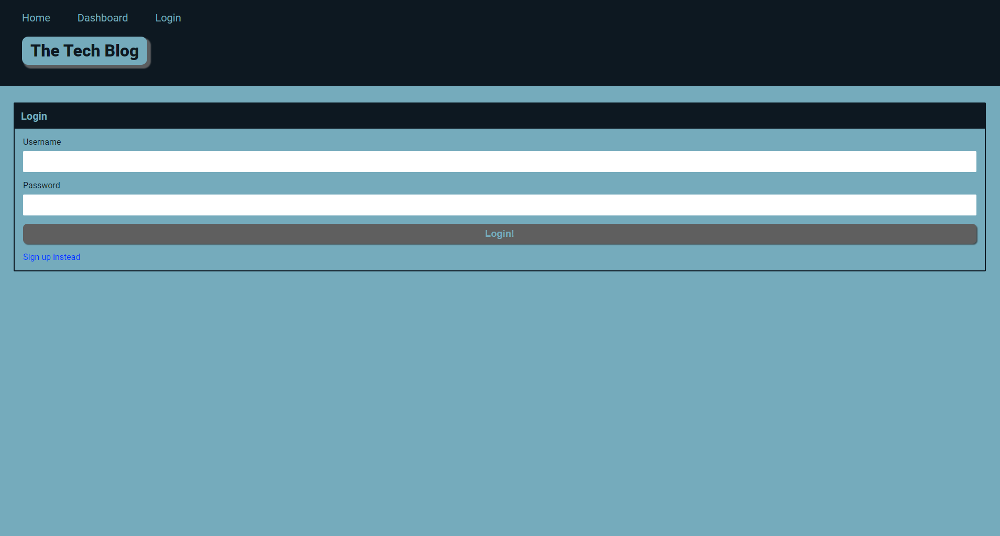
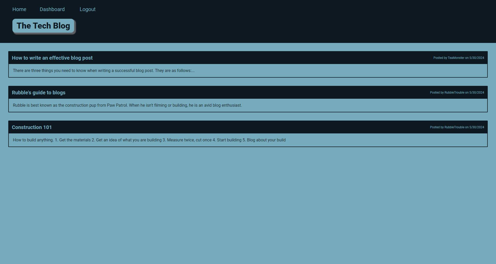
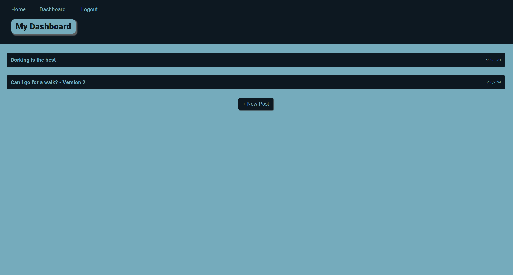
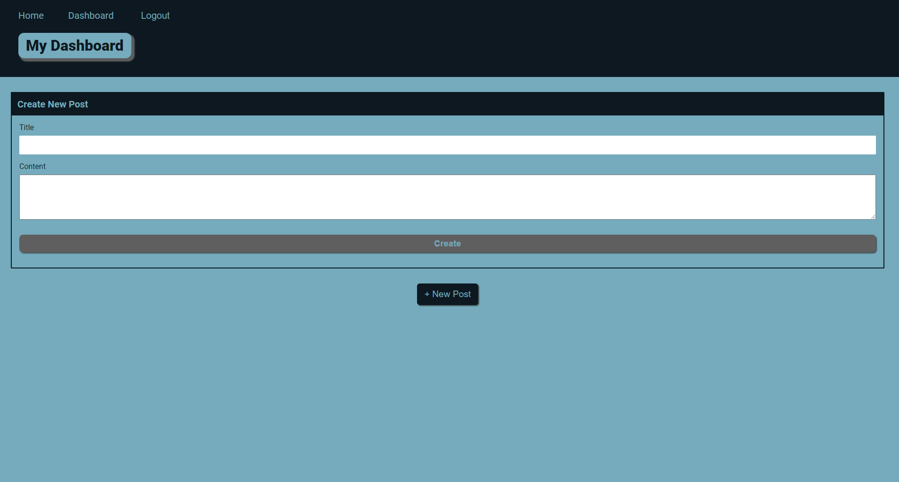
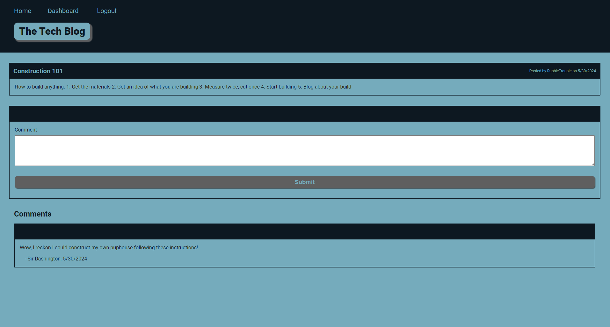
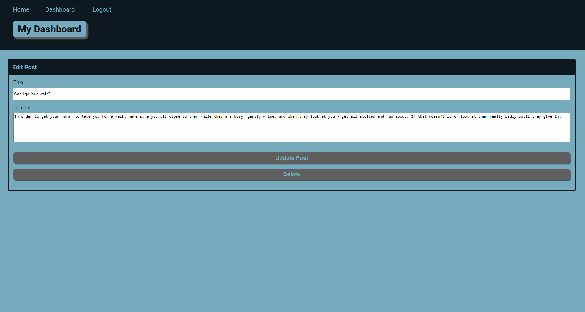

# Tech-Blog

  [](https://opensource.org/licenses/MIT)
  
  ## DESCRIPTION
This is a fully functional blog site, with the ability to view posts, add comments on existing posts, add new posts, edit and delete posts. It also features user login, so comments and posts can only be created when the user is logged in.
[Click here](https://tech-blog-ptz0.onrender.com/) to visit the example website: 

Screenshots









  ## TABLE OF CONTENTS
  
  <ol>
  <li><a href="#description">Description</a></li>
  <li><a href="#installation">Installation</a></li>
  <li><a href="#usage">Usage</a></li>
  <li><a href="#licence">Licence</a> </li>
  <li><a href="#contributions">Contributions</a></li>
  <li><a href="#questions">Questions</a></li>
  </ol>
  
  ## INSTALLATION
To clone from Github, use GitBash   
```git@github.com:gaylemcclure/tech-blog.git```
  
  ## USAGE
  Upon installation of the project, start the app using the terminal with the following commands:   
  ```npm i```
  ```npm run seed```
  ```npm run dev```

1. View the main homepage without being logged in
2. Have to sign up or login to view the other pages
3. Create a new user by signing up
4. This will log you in as well
5. Click on posts on the homepage to view all comments
6. As a logged in user, you can add new comments, which show straight away
7. My Dashboard link will show all posts you have created
8. If there are none, then it will show 'no posts'
9. Add a new post from here
10. On create post page, enter the title and content of the post and click Create
11. You will be taken back to your dashboard, and the new post will show the title only. 
12. Click on the post title to see edit or delete options


 
  
  ## LICENCE
  Distributed under the MIT license. For more information, see <a href=https://opensource.org/licenses/MIT>here</a>
  
  ## CONTRIBUTIONS
  Created by Gayle McClure   
  Uses JavaScript, node.js, postgres db, express, sequelize, bcrypt, render
  
  
  ## QUESTIONS
  Github Username: <a href='https://github.com/gaylemcclure'>Gayle McClure</a>  
  Feel free to email me at gaylekdennison@gmail.com for further questions. 
